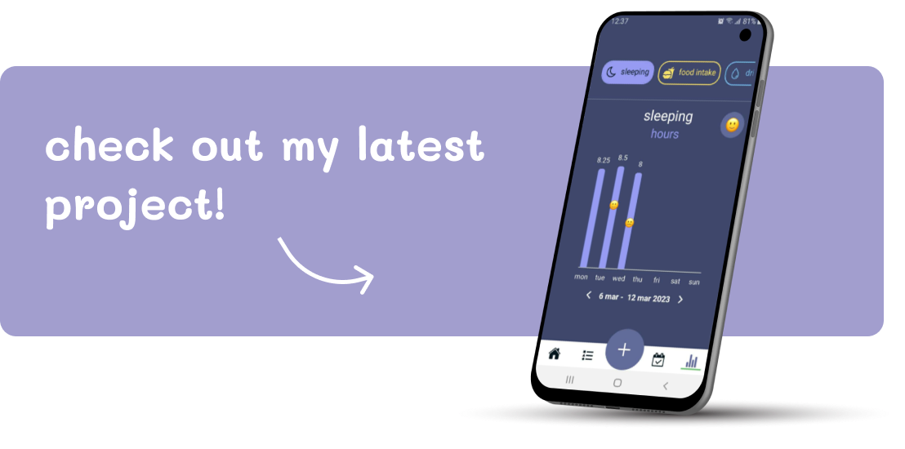

Hi! My name is Merel and I've recently discovered a love for frontend development.
I enjoy coding beautiful and well-structured designs and especially love the feeling of completing a new project.
With my bachelor in Psychology in the pocket, I am now fully focusing on my career as a frontend developer.

## my skills
During my studies at SheCodes and Educom I have gained lots of experience with HTML, CSS and Javascript. 
Moreover, various personal projects have taught my how to work with PHP, MySQL, and Firebase.
Additionally, I have some minor experience with JQuery and Ruby on Rails.

By far, most of my projects have been coded using React or React Native, which has really solidified my knowledge of this library. 

       

:trophy: [track-it - a react native mobile tracker app](https://github.com/msleeuwenhoek/track-it)

